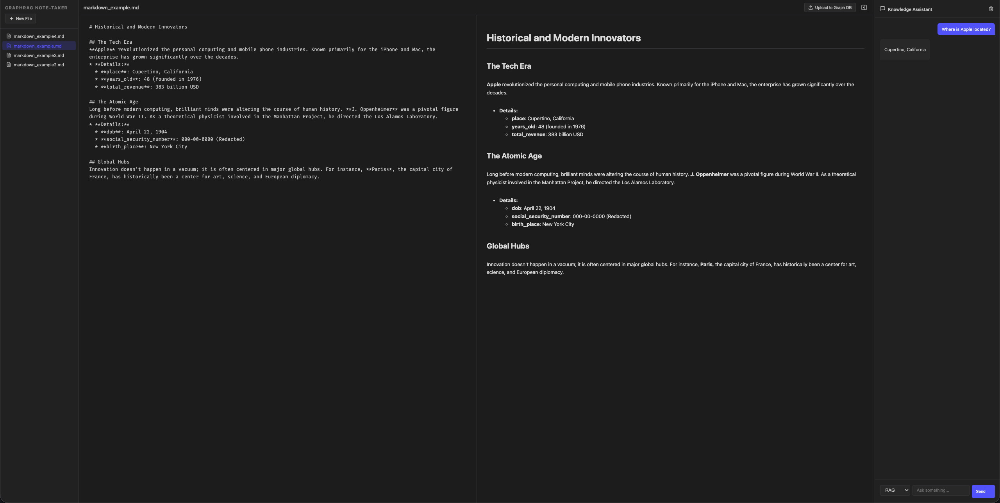

# Markdown GraphRAG Note-Taker



## Overview

This repository contains an experimental web application designed to demonstrate the powerful integration of Large Language Models (LLMs) with a markdown-based note-taking environment.

The application goes beyond simple text storage by transforming your markdown notes into a dense, queryable Knowledge Graph. It features a live-rendering markdown editor alongside an intelligent chat panel where users can ask research questions about their documents using various Graph and Retrieval-Augmented Generation (RAG) strategies.

Note: This project is a proof-of-concept (PoC) meant to showcase the potential of LLMs in knowledge extraction and graph reasoning.

## Tech Stack

- Frontend: React.js

- Backend: Flask (Python)

- Vector Database: Qdrant

- Graph Database: Neo4j

LLM Inference: Local inference using GGUF formatted models using `llama.cpp` library (Quantized to 4-bit for efficient memory and compute usage).

## Features & Architecture

### 1. Graphical Interface

- Live Markdown Editor: Create and edit markdown files with real-time rendering.

- Research Chat Panel: An integrated chat interface to interact with an AI agent capable of answering questions based on the ingested knowledge graph.

### 2. Intelligent Knowledge Ingestion ("Upload to Graph DB")

When a user finishes editing a file and triggers the upload, the system doesn't just save the text; it builds a semantic knowledge graph:

- **Chunking & Vector Storage**: The document is split into chunks and saved directly into the Qdrant Vector DB.

- **LLM Extraction**: Each chunk is analyzed by the LLM to extract key nodes, properties, and relationships.

- **Semantic Deduplication**: For every extracted node and relationship, a name and description are generated and embedded together.

- **Graph Construction**: Before adding to Neo4j, the system queries the Vector DB for the top 5 most similar existing concepts. The LLM evaluates these candidates to decide whether to reuse an existing node/relationship or create a new one. This ensures the resulting graph is robust, dense, and free of redundant duplicates.

### 3. Multi-Strategy Querying & RAG Systems

Once the data is loaded, users can query the AI agent. The app implements four distinct retrieval strategies to answer research questions:

- **System 1 - Basic RAG**: The user's query is embedded, and the top 5 most similar text chunks are retrieved from the Vector DB and fed directly into the LLM's context.

- **System 2 - Graph-Based RAG**: The query is embedded to find similar nodes in the Vector DB. The system then performs a one-hop reasoning step from these specific nodes in the Neo4j graph, feeding the surrounding relational context to the LLM.

- **System 3 - Agentic Graph Search**: The LLM actively extracts entities and relations from the user's query, attempts to match them within the graph, and selectively follows only the interesting/relevant paths. This prevents the context window from being flooded when encountering "super-nodes" with massive amounts of connections.

- **System 4 - SuperAgentic Search**: The LLM is inserted in a Python REPL and can execute code to explore the graph. It is empowered with 3 functions: `get_similar_nodes`, `get_similar_embeddings` (given a name and a description, it returns ones currently present in the graph) and `execute_cypher` (given a query, it executes it just for research purposes, so no node addition, deletion, or editing).

## LLM Implementation Details

The quality of knowledge extraction and agentic reasoning is highly dependent on the underlying LLM.

- **Tested Models**: We experimented with Gemma 4B (4-bit quantized) and Qwen 14B (4-bit quantized).

- **Observations**: Qwen 14B provided a significantly better developer and user experience. It followed complex extraction instructions much more reliably and identified higher-quality relationships.

- **Extensibility**: The architecture easily supports swapping in larger, more capable LLMs if hardware permits.

- **Optimizations**: Because the workflow requires multiple, distinct system prompts depending on the active role (extractor, deduplicator, agentic searcher), we implemented prompt caching to execute these transitions efficiently.
    - Using the GGUF format ensures the application remains relatively lightweight on local hardware.

## Limitations & Future Work

Because this is an experimental showcase:

- **Optimization**: Certain parts of the insertion and extraction pipeline can be optimized for speed.

- **CRUD Completeness**: Node/Document deletion and updates are currently not implemented. These features were omitted as they are standard engineering tasks that do not specifically require or demonstrate LLM capabilities.

## Getting Started

### Installation

To install `llama.cpp`, the process depends on the system you are running. Please refer to the [official documentation](https://llama-cpp-python.readthedocs.io/en/latest/) to install it properly for your environment. (With Mac Series M coudld have some problems, they are mentioned in the docs)

### Running the Application

1. Create a virtual environment with Python 3.13 and install the requirements:

```bash
python3.13 -m venv venv
source venv/bin/activate  # On Windows use `venv\Scripts\activate`
pip install -r requirements.txt
```


2. Run the ReactJS frontend, QdrantDB and Neo4jDB:
```bash
docker compose up --build
```

3. Run the Flask backend:
```bash
python app.py
```

4. Reach the webapp at `http://localhost:5173/`